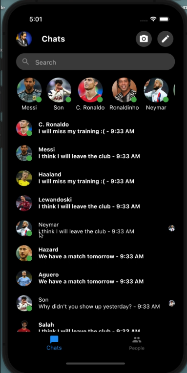
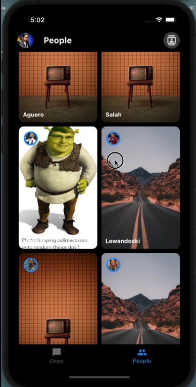
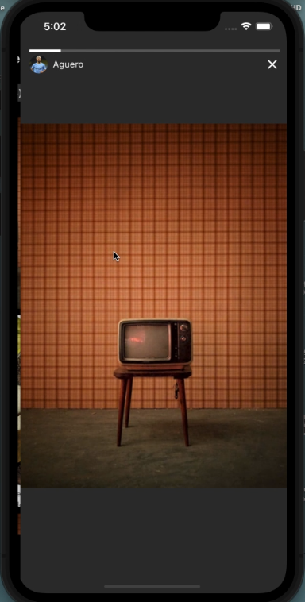
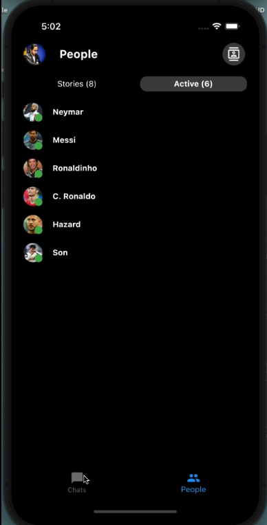

# Messenger UI Clone

Minimal Facebook Messenger UI made with Flutter - Dark Mode

# Screenshots






## Getting Started

This project is a starting point for a Flutter application.

Run this project
```sh
git clone https://github.com/nikkon404/messenger-flutter
flutter pub get
flutter run
```


## Note
I do know own any of the images used in this project!

Please star and follow me if you like it :)
